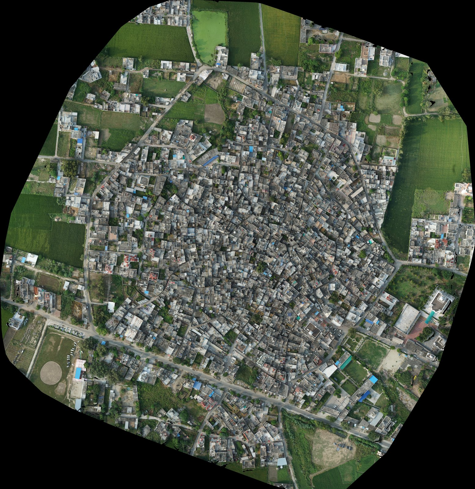
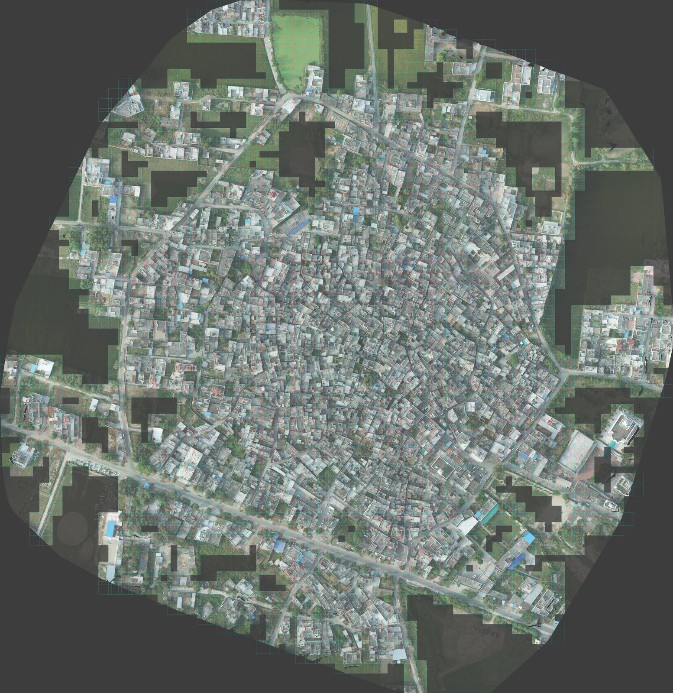
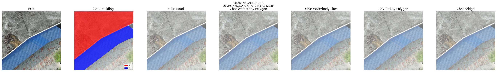
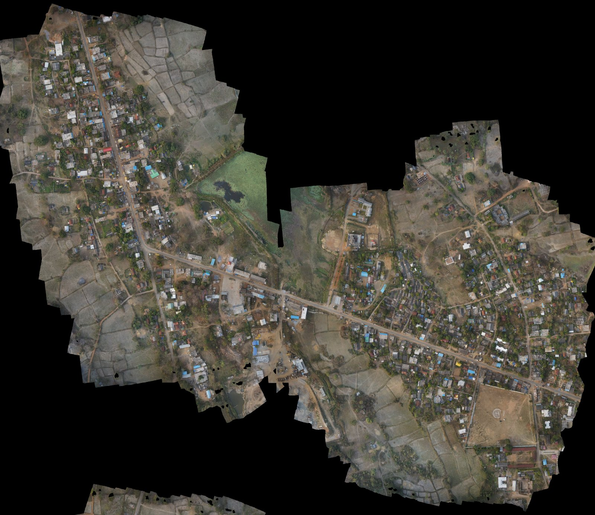
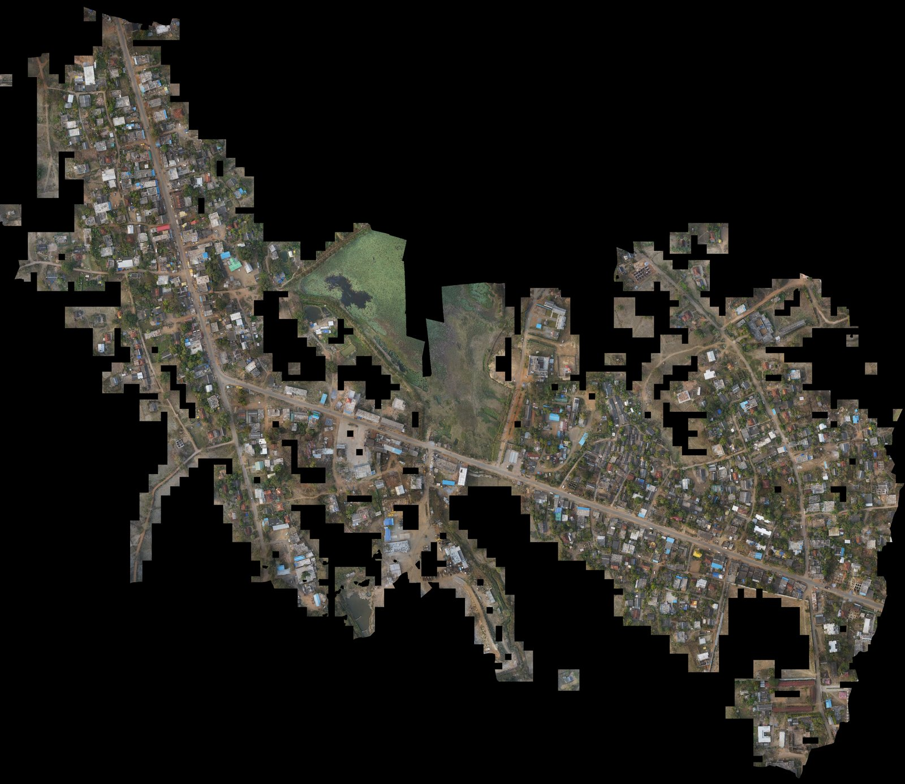
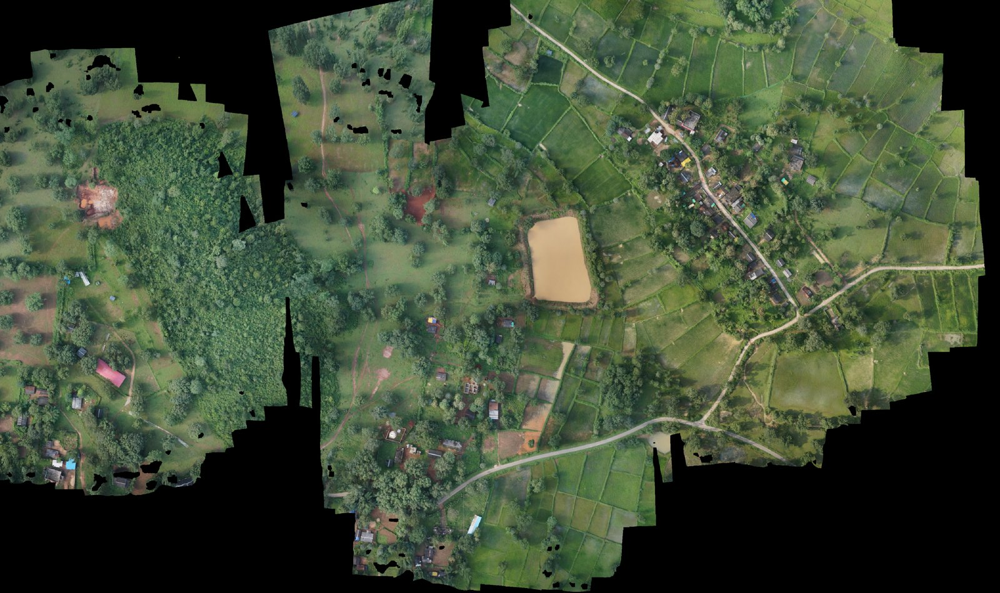
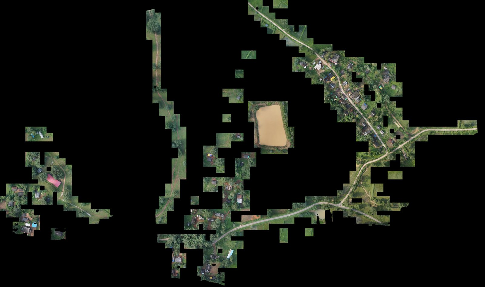
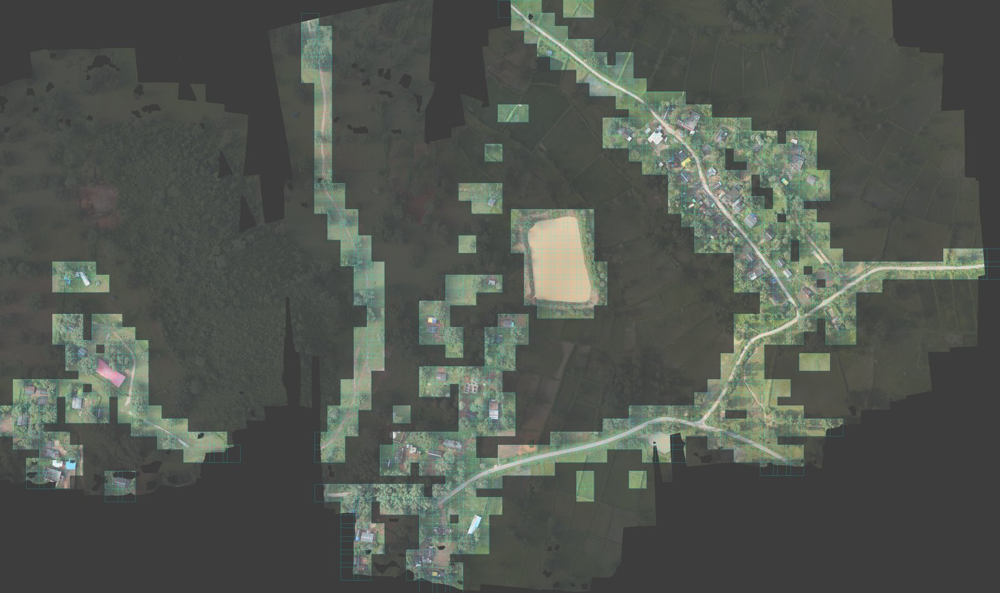
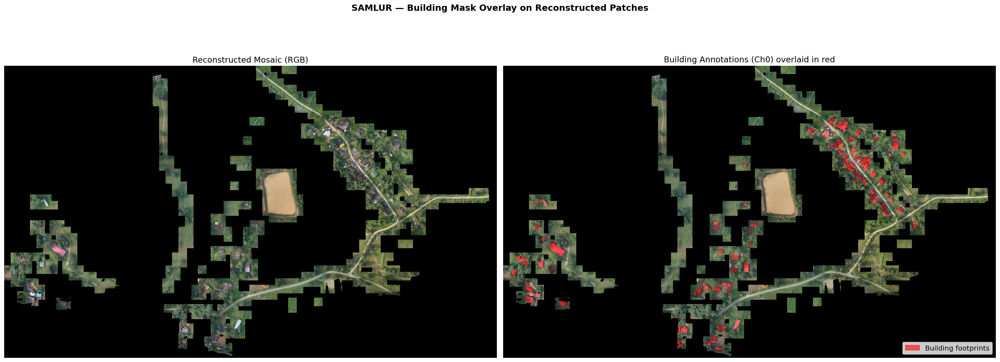

# GeoSpace: Automated Rural Feature Extraction from Drone Imagery using Deep Learning
Team: Nikhileswara Rao Sulake, Sai Manikanta Eswar Machara, 

> **MoPR Hackathon — Problem Statement 1**
> Pixel-level land-use classification from SVAMITVA drone survey orthophotos using SegFormer-B2.

---

## Overview

This project preprocesses high-resolution drone orthophotos (4 cm/px, EPSG:32643/32644) from the **SVAMITVA** (Survey of Villages Abadi and Mapping with Improvised Technology in Village Areas) program into 512×512 patches paired with 9-channel semantic masks, for training a multi-class segmentation model.

Two states are covered — **Punjab (PB)** and **Chhattisgarh (CG)** — across **9 villages**, producing **15,695 geo-referenced patch pairs**.

<p align="center">
  
  &nbsp;
  
</p>
<p align="center"><em>Left: Original orthophoto (Nadala, Punjab). Right: Patch coverage map — cyan borders show extracted patches, dark gaps are annotation-free regions filtered out during preprocessing.</em></p>

---

## Dataset

### Source Data

| Input | Description |
|-------|-------------|
| Drone orthophotos | Multi-band GeoTIFF, 4 cm/px resolution |
| Vector annotations | ESRI Shapefiles (buildings, roads, water bodies, utilities, bridges) |
| States | Punjab (PB) — 5 villages, Chhattisgarh (CG) — 4 villages |

### Preprocessed Output — 15,695 Patches

| Village | State | Patches | Train | Val |
|---------|:-----:|--------:|------:|----:|
| MURDANDA_450879 | CG | 2,964 | 2,371 | 593 |
| 28996_NADALA | PB | 2,869 | 2,295 | 574 |
| TIMMOWAL_37695 | PB | 2,685 | 2,148 | 537 |
| 37774_bagga | PB | 1,753 | 1,402 | 351 |
| BADETUMNAR_450157 | CG | 1,581 | 1,264 | 317 |
| 37458_fattu_bhila | PB | 1,450 | 1,160 | 290 |
| PINDORI_28456 | PB | 961 | 768 | 193 |
| NAGUL_450171 | CG | 791 | 632 | 159 |
| SAMLUR_450163 | CG | 641 | 512 | 129 |
| **Total** | | **15,695** | **12,552** | **3,143** |

### Mask Channels (9 classes)

| Ch | Layer | Attribute | Classes | Foreground % |
|:--:|-------|-----------|:-------:|-------------:|
| 0 | Building | Roof type | RCC, Tiled, Tin, Others | ~24% |
| 1 | Road | Road type | 5 sub-types | ~8.5% |
| 2 | Railway | — | — | ~0% (dropped) |
| 3 | Waterbody (polygon) | Type | 6 sub-types | ~6.7% |
| 4 | Waterbody (line) | Type | 3 sub-types | ~0.02% |
| 5 | Waterbody (point) | — | — | ~0% (dropped) |
| 6 | Utility (point) | — | — | ~0% (dropped) |
| 7 | Utility (polygon) | Type | 1 type | ~0.006% |
| 8 | Bridge | Type | 1 type | ~0.007% |

---

## Patch Extraction Pipeline

```
Orthophoto (160K × 176K px)
    │
    ├── Sliding window: 512×512 px, stride 384 (25% overlap)
    ├── For each window position:
    │     ├── Read image tile from ortho
    │     ├── Clip 9 shapefile layers to tile bounds
    │     ├── Rasterize each layer → 512×512 mask channel
    │     └── Stack into 9-channel mask
    │
    ├── Filter: skip patches where mask is all-zero
    │
    └── Write: {village_id}_{y}_{x}.tif  (image + mask)
```

Each patch retains its full geo-transform (CRS, bounds, resolution) enabling pixel-perfect reconstruction back to the original orthophoto.

<p align="center">
  
</p>
<p align="center"><em>Sample 512×512 patch with mask channel overlays (Nadala, Punjab).</em></p>

---

## Patch Reconstruction Verification

To verify spatial correctness, patches are reconstructed back into a mosaic using their geo-coordinates and compared against the original orthophoto.

<p align="center">
  
  &nbsp;
  
</p>
<p align="center"><em>Murdanda (CG) — Original orthophoto vs reconstructed mosaic from 2,964 patches.</em></p>

<p align="center">
  
  &nbsp;
  
  &nbsp;
  
</p>
<p align="center"><em>Samlur (CG, 641 patches) — Original | Reconstructed | Coverage map. Only 18.7% of the grid has patches; the rest was filtered (no annotations).</em></p>

<p align="center">
  
</p>
<p align="center"><em>Building footprint annotations (Channel 0) overlaid in red on reconstructed patches.</em></p>

---

## License

This project uses data from the [SVAMITVA Scheme](https://svamitva.nic.in/), Ministry of Panchayati Raj, Government of India.
